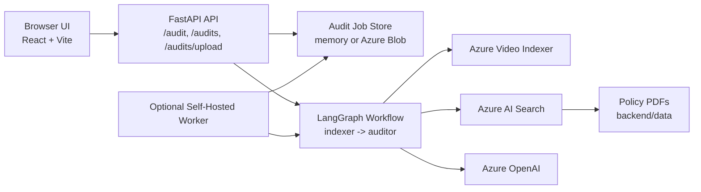

# YouTube Ad Compliance Checker

YouTube Ad Compliance Checker is an AI-powered compliance review system for advertisement videos, with a particular focus on YouTube ad workflows. It combines Azure Video Indexer, Azure AI Search, Azure OpenAI, FastAPI, and a React frontend to ingest video content, extract spoken and on-screen text, retrieve relevant policy material from a small document knowledge base, and return a structured compliance judgment.

This repository reads like an MVP and deployable demo rather than a finished enterprise platform, and that is part of what makes it interesting. The codebase shows a practical AI pipeline, a usable async job model, and a thoughtful workaround for a real deployment issue: YouTube downloads that may be blocked from Azure-hosted environments.

Here's the website (deployed on Azure): https://youtube-ad-compliance-checker-srikara.azurewebsites.net/

## Why this project exists

Reviewing ad creative against platform or disclosure rules is slow, repetitive, and context-heavy. A reviewer has to:

- inspect the ad itself
- capture what is spoken and shown on screen
- cross-reference policy documents
- decide whether a claim, disclosure, or creative choice is acceptable
- summarize the decision in a way that others can act on

This project turns that into a small retrieval-backed audit pipeline:

- extract transcript and OCR from the video
- retrieve relevant policy chunks from indexed reference PDFs
- ask an LLM to produce a structured compliance decision
- expose the result through an API and a simple web UI

## Key features

- FastAPI backend with both synchronous and async audit flows
- React + Vite frontend for creating and tracking audit jobs
- LangGraph audit workflow with separate indexing and auditing stages
- Azure Video Indexer integration for transcript and OCR extraction
- Azure AI Search vector retrieval over policy documents stored in `backend/data`
- Azure OpenAI for embeddings and final compliance judgment
- Async audit job model with polling-friendly status tracking
- In-memory job storage for local-only runs
- Azure Blob-backed job storage for shared Azure plus local worker operation
- Self-hosted worker mode for YouTube audits when Azure-side downloads are blocked
- GitHub Actions CI/CD and Azure App Service deployment support

## What makes this project interesting

The standout design choice in this repo is the split execution model for YouTube jobs.

The backend can run audits directly in Azure, but YouTube downloads are sometimes blocked from cloud IP ranges. This repo acknowledges that constraint and works around it with a shared job queue plus a local worker:

- Azure App Service hosts the API and, in production, the built React frontend
- for shared worker mode, the API stores audit jobs in Azure Blob Storage
- YouTube jobs can be marked for `self_hosted` execution
- a machine on a home or local network polls the shared queue, claims the job, runs the same LangGraph workflow locally, and writes the result back
- the browser keeps polling the API until the job reaches `COMPLETED` or `FAILED`

That architecture is more interesting than a generic "upload a file and call an LLM" demo because it solves an actual operational problem without throwing away the cloud-hosted UX.

## System architecture



### Main components

- `backend/src/api/server.py`
  Exposes the HTTP API, handles upload validation, creates async jobs, and serves the built frontend when `frontend/dist` exists.
- `backend/src/graph/workflow.py`
  Defines the LangGraph workflow with two nodes: `indexer` and `auditor`.
- `backend/src/graph/nodes.py`
  Implements the actual audit pipeline logic.
- `backend/src/services/video_indexer.py`
  Wraps YouTube/media normalization, metadata lookup, Video Indexer upload and polling, transcript fallback, and extraction helpers.
- `backend/src/api/audit_jobs.py` and `backend/src/api/job_store.py`
  Implement async job orchestration and storage.
- `backend/src/worker/self_hosted_worker.py`
  Runs the shared-queue local worker for `self_hosted` YouTube jobs.
- `frontend/src/App.tsx`
  Implements the current UI, including file upload, job polling, issue display, and markdown report rendering.

## End-to-end workflow

The core pipeline is a two-stage LangGraph workflow defined in `backend/src/graph/workflow.py`:

1. `indexer`
2. `auditor`

### 1. Job creation and preview

Depending on the entry point, the system accepts:

- a YouTube URL
- a remote media URL
- an uploaded video file

The async API validates the input, builds preview metadata, creates a job record, and either starts background execution immediately or leaves the job queued for a self-hosted worker.

### 2. Indexer stage

The `indexer` node is responsible for turning video into auditable text:

- normalize YouTube and media URLs
- fetch YouTube metadata where needed
- download YouTube media when needed
- upload media or media URLs to Azure Video Indexer
- wait for Azure processing to complete
- extract transcript text and OCR text from the returned insights

For YouTube specifically, the code includes a fallback path. If Azure-side downloading triggers a bot challenge or similar blocking condition, the indexer falls back to `youtube-transcript-api` and continues with transcript-only input instead of failing immediately.

### 3. Retrieval stage

The `auditor` node builds a retrieval query from:

- transcript text
- OCR text

It then uses Azure OpenAI embeddings plus Azure AI Search to retrieve the most relevant policy chunks from the indexed PDF knowledge base.

### 4. LLM audit stage

The same `auditor` node constructs a system prompt that includes:

- retrieved policy text
- extracted transcript
- OCR text
- video metadata

It then calls an Azure-hosted chat model and expects strict JSON back in this general shape:

```json
{
  "compliance_results": [
    {
      "category": "Claim Validation",
      "severity": "CRITICAL",
      "description": "Explanation of the violation..."
    }
  ],
  "status": "FAIL",
  "final_report": "Summary of findings..."
}
```

### 5. Result delivery

Async jobs move through these states:

- `QUEUED`
- `PROCESSING`
- `COMPLETED`
- `FAILED`

The frontend polls `GET /audits/{audit_id}` every 3 seconds until the job reaches a terminal state, then renders:

- a compliance verdict
- a list of issues
- the final markdown report

## Supported inputs and outputs

### Backend-supported inputs

The backend currently supports three audit sources:

- YouTube URL via `POST /audits`
- remote media URL via `POST /audits`
- uploaded video file via `POST /audits/upload`

Uploaded files are validated against these extensions:

- `.mp4`
- `.mov`
- `.m4v`
- `.webm`
- `.avi`
- `.mkv`
- `.mpeg`
- `.mpg`

### Current frontend UI

The checked-in React UI currently exposes local file upload as the visible submission mode. The frontend codebase still contains API helpers and validation utilities for YouTube and remote media URLs, but the current `App.tsx` only presents an upload flow.

That distinction matters:

- the backend supports YouTube URLs, remote media URLs, and uploads
- the current checked-in UI visibly supports uploads only

### Output shape

At a high level, the system returns:

- job status: `QUEUED`, `PROCESSING`, `COMPLETED`, `FAILED`
- compliance status: `PASS`, `FAIL`, `UNKNOWN`
- compliance issues with `category`, `severity`, and `description`
- a final markdown report

Example result shape:

```json
{
  "audit_id": "d3d4d3f2-8d14-4bdb-a30d-0cb96e1c0b11",
  "job_status": "COMPLETED",
  "video": {
    "video_url": "uploaded://ad.mp4",
    "source_type": "upload",
    "source_label": "ad.mp4",
    "youtube_video_id": null,
    "title": "Ad",
    "thumbnail_url": null
  },
  "result": {
    "status": "PASS",
    "compliance_results": [],
    "final_report": "No issues found."
  },
  "error": null,
  "created_at": "2026-04-19T00:00:00+00:00",
  "updated_at": "2026-04-19T00:01:00+00:00"
}
```

## Project structure

```text
backend/
  data/                         Reference PDFs used for policy retrieval
  scripts/index_documents.py    PDF chunking and Azure AI Search indexing logic
  src/api/                      FastAPI server, job orchestration, job storage, telemetry
  src/graph/                    LangGraph workflow, nodes, state
  src/services/                 Azure Video Indexer and media handling utilities
  src/worker/                   Self-hosted shared-queue worker
  tests/                        Backend unit tests
docs/
  azure-app-service.md          Azure deployment guide
frontend/
  src/                          React UI, API client, types, validation utils
  vite.config.ts                Dev proxy and test config
scripts/
  azure/                        Azure bootstrap and GitHub OIDC setup scripts
  github/                       Branch protection helper
main.py                         Legacy direct workflow runner / CLI-style harness
startup.sh                      Gunicorn + Uvicorn startup command for App Service
```

## Tech stack

- Python 3.12
- FastAPI
- LangGraph
- LangChain
- Azure Video Indexer
- Azure OpenAI
- Azure AI Search
- Azure Blob Storage
- React 19
- Vite
- React Query
- React Markdown
- GitHub Actions
- Azure App Service
- Azure Monitor / OpenTelemetry

## Prerequisites

- Python 3.12
- Node.js 20 or newer
- npm
- Azure resources for:
  - Azure OpenAI
  - Azure AI Search
  - Azure Video Indexer
  - Azure Blob Storage if you want shared job mode
- Valid configuration for the environment variables referenced by the app

For Azure deployment work, you will also need:

- Azure CLI
- permission to create App Service resources and Microsoft Entra applications

## Installation

This repo currently straddles two Python workflows:

- local development leans toward `uv` because the repo includes `pyproject.toml` and `uv.lock`
- CI and Azure App Service install from `requirements.txt`

The command examples below use PowerShell and the Windows-friendly `npm.cmd` form, which matches the existing repo docs and scripts.

### Backend dependencies

Option A: local `uv` workflow

```powershell
uv sync
```

Option B: `pip` workflow aligned with CI/App Service

```powershell
python -m pip install --upgrade pip
pip install -r requirements.txt
```

### Frontend dependencies

```powershell
cd frontend
npm.cmd install
```

## Configuration

There is no dedicated `.env.example` in the repo. The variable list below is based on the names referenced by the application code, tests, and deployment scripts.

### Azure OpenAI

| Variable | Purpose |
| --- | --- |
| `AZURE_OPENAI_ENDPOINT` | Azure OpenAI endpoint used for embeddings and chat completions |
| `AZURE_OPENAI_API_KEY` | API key for Azure OpenAI where key-based auth is used |
| `AZURE_OPENAI_API_VERSION` | Azure OpenAI API version |
| `AZURE_OPENAI_CHAT_DEPLOYMENT` | Chat model deployment used by the auditor node |
| `AZURE_OPENAI_EMBEDDING_DEPLOYMENT` | Embedding deployment used for retrieval |

### Azure AI Search

| Variable | Purpose |
| --- | --- |
| `AZURE_SEARCH_ENDPOINT` | Azure AI Search service endpoint |
| `AZURE_SEARCH_API_KEY` | Azure AI Search API key |
| `AZURE_SEARCH_INDEX_NAME` | Index name used for policy retrieval |

### Azure Video Indexer and Azure auth

| Variable | Purpose |
| --- | --- |
| `AZURE_VI_NAME` | Azure Video Indexer account name |
| `AZURE_VI_LOCATION` | Azure Video Indexer region |
| `AZURE_VI_ACCOUNT_ID` | Azure Video Indexer account ID |
| `AZURE_SUBSCRIPTION_ID` | Azure subscription used to obtain Video Indexer access |
| `AZURE_RESOURCE_GROUP` | Azure resource group for the Video Indexer account |

The Video Indexer client uses `DefaultAzureCredential`, and the App Service bootstrap flow assigns `Contributor` on the Video Indexer account so the app can call `generateAccessToken`.

### Job storage and execution mode

| Variable | Purpose |
| --- | --- |
| `AZURE_STORAGE_CONNECTION_STRING` | Required for Azure Blob-backed shared job storage |
| `AUDIT_JOB_STORE` | `memory` for local-only jobs, or `azure_blob` for shared storage |
| `AUDIT_JOB_BLOB_CONTAINER` | Blob container for job records, defaults to `audit-jobs` |
| `AUDIT_JOB_BLOB_PREFIX` | Blob prefix for job JSON documents, defaults to `jobs` |
| `YOUTUBE_AUDIT_EXECUTION_TARGET` | `azure` or `self_hosted` for YouTube job execution |

Important nuance:

- `YOUTUBE_AUDIT_EXECUTION_TARGET` only affects YouTube URL jobs
- uploaded files and remote media URLs still follow the direct Azure execution path in the current backend

### Frontend and backend integration

| Variable | Purpose |
| --- | --- |
| `FRONTEND_ORIGINS` | Allowed browser origins for CORS |
| `FRONTEND_DIST_DIR` | Override for the built frontend directory served by FastAPI |
| `UPLOAD_TEMP_DIR` | Base temp directory for uploaded media files |
| `VITE_API_BASE_URL` | Frontend API base URL override when not using the Vite proxy |

### Telemetry and optional tracing

| Variable | Purpose |
| --- | --- |
| `APPLICATIONINSIGHTS_CONNECTION_STRING` | Enables Azure Monitor / Application Insights |
| `LANGCHAIN_TRACING_V2` | Optional LangChain tracing setting present in the repo configuration |
| `LANGCHAIN_ENDPOINT` | Optional LangChain tracing endpoint |
| `LANGCHAIN_API_KEY` | Optional LangChain tracing API key |
| `LANGCHAIN_PROJECT` | Optional LangChain project name |

### Optional self-hosted worker settings

These are referenced by `backend/src/worker/self_hosted_worker.py`:

| Variable | Purpose |
| --- | --- |
| `SELF_HOSTED_WORKER_ID` | Override for the worker ID written into claimed jobs |
| `SELF_HOSTED_WORKER_POLL_SECONDS` | Poll interval when the worker is waiting for jobs |

## Running locally

### Backend API

From the repo root:

```powershell
uv run uvicorn backend.src.api.server:app --reload
```

The API will be available at `http://127.0.0.1:8000`.

### Frontend dev server

From the `frontend` directory:

```powershell
npm.cmd run dev
```

The Vite dev server runs on `http://127.0.0.1:5173` and proxies:

- `/audit`
- `/audits`
- `/health`

to `http://127.0.0.1:8000` by default.

### Frontend production build

From the `frontend` directory:

```powershell
npm.cmd run build
```

When `frontend/dist` exists, FastAPI can serve the built frontend at `/`.

### Full-stack development flow

1. Start the backend on port `8000`
2. Start the frontend on port `5173`
3. Upload a local video from the browser
4. Watch the UI poll the async audit endpoint until the job finishes

### Legacy direct workflow harness

The repo also contains `main.py`, which invokes the compliance graph directly with a hardcoded YouTube URL. It is better understood as a developer harness than as the main supported runtime entry point.

## Practical example flow

Here is the current checked-in UI flow for a local upload:

1. A user opens the React app and selects an `.mp4` file.
2. The frontend submits the file to `POST /audits/upload` as multipart form data.
3. FastAPI validates the extension, saves the file to a temp directory, creates an audit job, and starts background processing.
4. The `indexer` node uploads the file to Azure Video Indexer and waits for transcript and OCR results.
5. The `auditor` node retrieves relevant policy chunks from Azure AI Search and asks Azure OpenAI for a structured compliance judgment.
6. The backend stores the final status and result on the job.
7. The frontend keeps polling `GET /audits/{audit_id}` every 3 seconds.
8. Once the job reaches `COMPLETED`, the UI renders the pass or fail verdict, issue cards, and markdown report.

## Indexing the policy and reference documents

The knowledge base for retrieval currently lives in `backend/data` and includes at least:

- `youtube-ad-specs.pdf`
- `1001a-influencer-guide-508_1.pdf`

The indexing logic lives in `backend/scripts/index_documents.py`. That script:

- loads PDFs with `PyPDFLoader`
- splits them with `RecursiveCharacterTextSplitter`
- generates embeddings with Azure OpenAI
- uploads the resulting chunks into Azure AI Search

This indexing step is what makes the audit retrieval-backed rather than purely prompt-based. The `auditor` node later runs similarity search against that index before asking the chat model for a decision.

Current caveat: the module contains the indexing function, but its `__main__` block does not currently call `index_docs()` automatically. Treat the file as the source of truth for the indexing workflow, but expect to tighten that entrypoint before relying on it as a polished one-command CLI.

## Running the self-hosted worker

The self-hosted worker exists to handle the case where Azure-hosted YouTube downloading is blocked.

### When to use it

Use the worker when:

- your web app is hosted on Azure
- you want the browser and API to stay cloud-hosted
- YouTube URL audits should run from your own machine or home network instead of App Service

### Required setup

At minimum:

- set `AUDIT_JOB_STORE=azure_blob`
- set `YOUTUBE_AUDIT_EXECUTION_TARGET=self_hosted`
- make sure both Azure App Service and the local worker share the same `AZURE_STORAGE_CONNECTION_STRING`

### Run the worker

From the repo root:

```powershell
python -m backend.src.worker.self_hosted_worker
```

One-shot mode:

```powershell
python -m backend.src.worker.self_hosted_worker --once
```

The worker:

- polls the shared job store
- claims the next queued `self_hosted` YouTube job
- runs the same compliance workflow locally
- writes the final status and result back to the shared job record

## API overview

### `POST /audit`

Legacy synchronous endpoint. Runs the compliance workflow directly and returns the final result in one response. This is the closest thing to the original script-friendly or CLI-style contract.

### `POST /audits`

Creates an async audit job for:

- YouTube URLs
- remote media URLs

The response includes:

- `audit_id`
- current `job_status`
- video preview metadata
- timestamps

### `POST /audits/upload`

Creates an async audit job for an uploaded video file. This is the endpoint used by the current checked-in frontend UI.

### `GET /audits/{audit_id}`

Returns the latest state of an async job, including:

- job status
- preview metadata
- error message if the job failed
- final result payload if the job completed

### `GET /health`

Simple health check endpoint.

## Deployment

The repo is set up for a single-host Azure deployment path:

- one Linux Azure App Service hosts the FastAPI app
- the same FastAPI app serves the built React frontend from `frontend/dist`
- GitHub Actions runs tests and deploys `main`

### Key deployment files

- `startup.sh`
  Starts Gunicorn with the Uvicorn worker and points at `backend.src.api.server:app`
- `.github/workflows/ci-cd.yml`
  Runs backend tests, frontend tests, frontend build, and deploys to Azure on pushes to `main`
- `docs/azure-app-service.md`
  Describes the end-to-end App Service deployment flow
- `scripts/azure/bootstrap_app_service.ps1`
  Creates the resource group, App Service plan, web app, identity, app settings, and Video Indexer role assignment
- `scripts/azure/create_github_oidc.ps1`
  Creates or reuses the Microsoft Entra app and GitHub OIDC federated credentials

### Build and deploy behavior

The GitHub Actions workflow currently:

- installs Python dependencies from `requirements.txt`
- runs `python -m unittest discover -s backend/tests`
- installs frontend dependencies with `npm ci --prefix frontend`
- runs `npm --prefix frontend run test`
- runs `npm --prefix frontend run build`
- vendors Python packages into `python_packages/lib/site-packages` for App Service deployment
- deploys the resulting package with `azure/webapps-deploy@v3`

In production, FastAPI serves the built frontend and falls back to `index.html` for client-side routes when the asset exists.

Current caveat: an empty `backend/Dockerfile` exists in the repo, but Docker is not part of the documented or wired deployment path.

## Observability and monitoring

Telemetry setup lives in `backend/src/api/telemetry.py`.

- If `APPLICATIONINSIGHTS_CONNECTION_STRING` is present, the app enables Azure Monitor / OpenTelemetry integration.
- If that variable is missing, the backend logs that telemetry is disabled and continues running.

The repo configuration also includes optional LangChain tracing variables, which may be useful if you want to add deeper workflow tracing during development.

## Testing

### Backend tests

From the repo root:

```powershell
python -m unittest discover -s backend/tests
```

The backend tests cover:

- API endpoint behavior
- async job transitions
- self-hosted worker behavior
- indexer fallback behavior
- Video Indexer helper logic

### Frontend tests

From the `frontend` directory:

```powershell
npm.cmd run test
```

The frontend tests validate the current upload-only UX, including:

- upload submission
- disabled submit state before file selection
- failed-job rendering

## Troubleshooting

### YouTube downloads fail from Azure

Symptom:

- YouTube metadata or downloading fails
- errors mention bot verification, authentication, captcha, or "sign in to confirm you're not a bot"

What the repo already does:

- tries to detect YouTube auth-challenge style failures
- falls back to `youtube-transcript-api` for transcript-only processing in some YouTube cases

What to do next:

- switch YouTube jobs to `self_hosted` mode
- make sure `AUDIT_JOB_STORE=azure_blob`
- run the local worker against the same Blob-backed queue

### Jobs stay queued forever

Likely causes:

- `AUDIT_JOB_STORE=memory` while expecting shared Azure plus worker behavior
- `YOUTUBE_AUDIT_EXECUTION_TARGET=self_hosted` without a running worker
- Blob storage misconfiguration or missing `AZURE_STORAGE_CONNECTION_STRING`

### The frontend root returns 404 in production

Likely cause:

- `frontend/dist` was not built or not included in the deployed package

The backend only serves the frontend when the built assets exist. Otherwise `/` returns a frontend-not-built error.

### Uploads fail immediately

Check:

- allowed file extensions
- `UPLOAD_TEMP_DIR` permissions
- backend logs for temp file handling or Azure Video Indexer upload errors

### Retrieval or audit output is weak or inconsistent

Check:

- whether the policy PDFs were indexed into Azure AI Search
- whether `AZURE_SEARCH_INDEX_NAME` points to the right index
- whether the embedding and chat deployment names are valid

### Document indexing does not run as expected

Check:

- the required Azure OpenAI and Azure AI Search variables
- whether the PDFs actually exist in `backend/data`
- whether you are relying on the current script entrypoint without accounting for the missing `index_docs()` call in `__main__`

## Current limitations

- The current checked-in frontend visibly supports file upload only, even though the backend supports YouTube and remote media URL inputs.
- The project is designed as an MVP and deployable demo, not a hardened production platform.
- The policy knowledge base is small and centered on PDFs currently stored in `backend/data`.
- The LLM audit step depends on strict JSON output from the chat model and will fail if the model response is malformed.
- Shared Azure plus self-hosted execution requires Blob-backed job storage and some operational setup.
- There is no dedicated `.env.example` in the repo at the moment.
- `backend/scripts/index_documents.py` contains the indexing logic but is not yet packaged as a polished CLI entrypoint.
- Docker is not currently a supported path despite the presence of an empty `backend/Dockerfile`.

## Future improvements

Reasonable next steps for this codebase would be:

- expose YouTube and remote media URL submission in the frontend
- add a proper `.env.example`
- harden the indexing flow into a reliable CLI or admin command
- persist richer audit metadata and reviewer notes
- add authentication, audit history, and multi-user support
- improve report explainability and evidence linking
- add more robust retry and recovery behavior around external Azure services

## Contributing

Contributions are easiest when they stay grounded in the current shape of the project:

- keep the distinction clear between backend capabilities and current UI exposure
- preserve the sync versus async API split
- avoid documenting or merging deployment paths that are not actually wired into the repo
- treat the self-hosted YouTube worker as a first-class part of the architecture, not a side note

If you extend the project, consider updating the deployment docs and tests alongside the feature so the repo stays as onboarding-friendly as possible.
