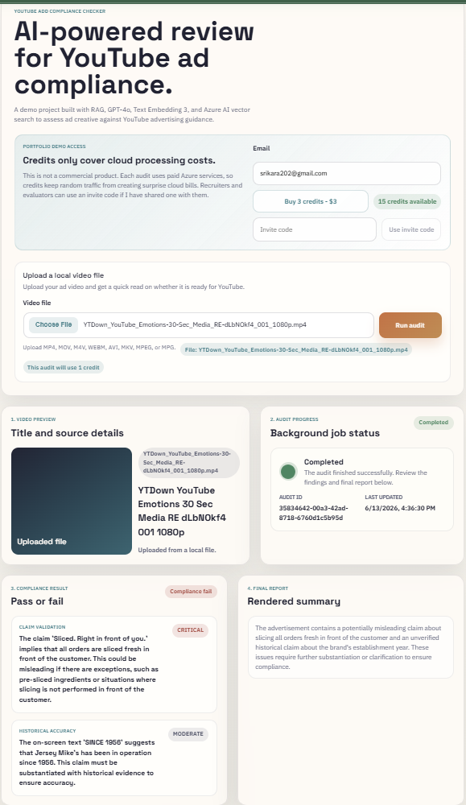
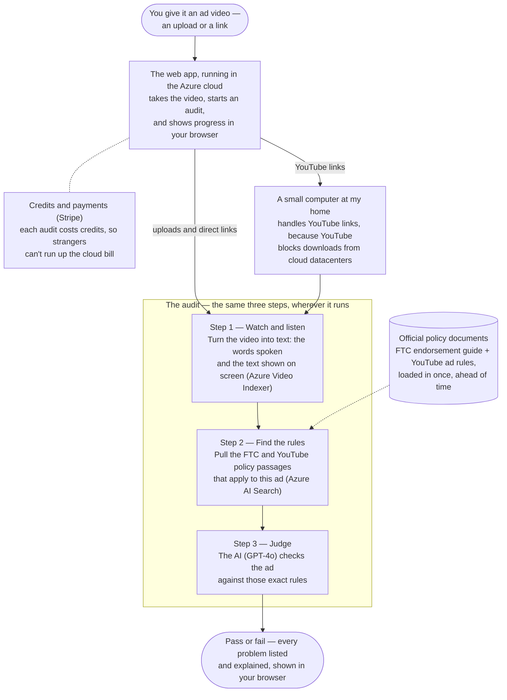

<h1 align="center">YouTube Ad Compliance Checker</h1>

<p align="center">
  An AI reviewer that watches a video ad, transcribes it, reads the on-screen text, and checks both against YouTube advertising and FTC disclosure rules — grounded in the actual policy PDFs, not the model's memory.
</p>

<p align="center">
  <a href="https://youtube-ad-compliance-checker-srikara.azurewebsites.net"><b>Live demo</b></a> ·
  <a href="https://github.com/srikara202/youtube-ad-compliance-checker">Source</a>
  <br/>
  
</p>

<p align="center">
  
  
  
  
  
  
  
</p>

<p align="center">
  
  
  
  
  
  
</p>

<p align="center">
  
  
  
</p>

---

## What it does

Reviewing an ad video by hand is slow and repetitive: someone has to watch it, write down what's said and what's shown, find the relevant policy clause, decide pass or fail, and write it up. This project does that pass automatically.

Give it a video — uploaded file, a direct media URL, or a YouTube link — and it extracts the spoken transcript and on-screen text, retrieves the policy passages that actually apply, asks GPT-4o for a structured verdict, and returns a pass/fail decision with per-issue cards (category, severity, explanation) and a written report. The judgment is retrieval-grounded: the model is shown real text pulled from an FTC influencer-disclosure guide and a YouTube ad-specs document, so a "FAIL" can point at a rule rather than a hunch.

It runs as a single deployed Azure web app with a React front end, an async job API, and a two-step LangGraph pipeline behind it. The part I'm most proud of isn't the happy path — it's what happened when the happy path broke in production (see [Key decisions](#key-decisions-and-tradeoffs)).

<p align="center">
  
  <br/>
  <sub><i>The app after a completed audit. The credit panel is the cost-control paywall, shown enabled — recruiters use an invite code instead of paying.</i></sub>
</p>

## Architecture

End to end, in plain terms:


```mermaid
flowchart TB
    YOU(["You give it an ad video —<br/>an upload or a link"])

    APP["The web app, running in the Azure cloud<br/>takes the video, starts an audit,<br/>and shows progress in your browser"]

    PAY["Credits and payments (Stripe)<br/>each audit costs credits, so strangers<br/>can't run up the cloud bill"]

    HOME["A small computer at my home<br/>handles YouTube links, because YouTube<br/>blocks downloads from cloud datacenters"]

    subgraph audit["The audit — the same three steps, wherever it runs"]
        S1["Step 1 — Watch and listen<br/>Turn the video into text: the words spoken<br/>and the text shown on screen (Azure Video Indexer)"]
        S2["Step 2 — Find the rules<br/>Pull the FTC and YouTube policy passages<br/>that apply to this ad (Azure AI Search)"]
        S3["Step 3 — Judge<br/>The AI (GPT-4o) checks the ad<br/>against those exact rules"]
    end

    RULES[("Official policy documents<br/>FTC endorsement guide + YouTube ad rules,<br/>loaded in once, ahead of time")]

    RESULT(["Pass or fail — every problem listed<br/>and explained, shown in your browser"])

    YOU --> APP
    APP -.- PAY
    APP -->|"uploads and direct links"| S1
    APP -->|"YouTube links"| HOME
    HOME --> S1
    S1 --> S2
    RULES -.-> S2
    S2 --> S3
    S3 --> RESULT
```

The audit itself is a LangGraph state machine with two nodes and a typed state object ([`state.py`](backend/src/graph/state.py), [`workflow.py`](backend/src/graph/workflow.py)):

1. **Indexer** ([`nodes.py:index_video_node`](backend/src/graph/nodes.py)) turns a video into text. For uploads and media URLs it submits to Azure Video Indexer and waits for the transcript and OCR. For YouTube it tries to fetch the media first, and falls back to the public transcript API when the download is blocked.
2. **Auditor** ([`nodes.py:audit_content_node`](backend/src/graph/nodes.py)) embeds the transcript plus OCR text, runs a top-3 similarity search against the policy index, stuffs the retrieved rules into the system prompt, and asks GPT-4o (temperature 0) for strict JSON. The result accumulates into the graph state through `operator.add` reducers, so issues and errors append rather than overwrite.

Policy documents are ingested separately ([`index_documents.py`](backend/scripts/index_documents.py)): PDFs are loaded with PyPDF, split at 1000 characters with 200 of overlap, embedded with `text-embedding-3-small`, and written to Azure AI Search.

## What this demonstrates

Mapped honestly to an AI/ML engineer role, with the file that backs each claim:

| Area | What's actually here |
|---|---|
| RAG pipeline | PDF ingestion → chunking → embeddings → vector store → retrieval-augmented prompting with a structured-JSON contract. [`index_documents.py`](backend/scripts/index_documents.py), [`nodes.py`](backend/src/graph/nodes.py) |
| LLM orchestration | A typed LangGraph DAG with append-only reducers for results and errors, designed so a third step (e.g. claim verification) drops in without rewiring. [`workflow.py`](backend/src/graph/workflow.py) |
| Applied multimodal extraction | Azure Video Indexer for speech-to-text and on-screen OCR, with an ARM-token exchange and a polling loop that handles the `Failed` and `Quarantined` states. [`video_indexer.py`](backend/src/services/video_indexer.py) |
| Production serving | Async job API, browser polling, background execution, and a cloud/self-hosted split to get around a real platform constraint. [`audit_jobs.py`](backend/src/api/audit_jobs.py), [`server.py`](backend/src/api/server.py) |
| Distributed-systems pragmatics | Azure Blob used as a shared job store and queue with ETag optimistic concurrency; an idempotent credit ledger with the same concurrency model. [`job_store.py`](backend/src/api/job_store.py), [`billing.py`](backend/src/api/billing.py) |
| Deployment / MLOps | GitHub Actions builds, tests, vendors dependencies, deploys to Azure over OIDC, and runs a post-deploy smoke test that checks the live commit SHA. [`ci-cd.yml`](.github/workflows/ci-cd.yml) |
| Security-aware coding | Stripe webhook signatures verified by hand (HMAC-SHA256, constant-time compare, 5-minute replay window), JWT access tokens, and managed identity for Azure calls. [`billing.py`](backend/src/api/billing.py) |
| Full-stack + testing | React 19 / TypeScript front end served by the same FastAPI process, and ~40 backend and front-end tests including idempotency and the YouTube fallback. [`backend/tests/`](backend/tests), [`App.test.tsx`](frontend/src/App.test.tsx) |

## Key decisions and tradeoffs

### Splitting execution between the cloud and a machine at home

The first deploy passed every local test and then failed in the cloud for exactly one input type: YouTube links. Azure's datacenter IP ranges get served a bot challenge — `"Sign in to confirm you're not a bot"` — so `yt-dlp` could not pull the media. Uploads and direct media URLs were fine, because those bytes never touch YouTube.

I didn't want to ship browser cookies or rent a residential proxy for a portfolio project, so I split execution by source type:

- Uploads and media URLs run **in the Azure process**, on a background thread, and finish in the cloud.
- YouTube jobs are written to a shared Azure Blob job store with `execution_target = self_hosted` and left `QUEUED`. A small worker ([`self_hosted_worker.py`](backend/src/worker/self_hosted_worker.py)) running on my own network polls that store, claims the next job with an ETag-guarded write so two workers can't grab the same one, runs the identical LangGraph workflow from a residential IP, and writes the result back. The browser is still just polling `GET /audits/{id}` and never knows where the work happened.

The download path itself degrades in three steps before giving up: resolve a direct progressive stream URL, fall back to the `yt-dlp` downloader, and — if a bot or auth challenge is detected — fall back to the public transcript API and audit on transcript alone.

The honest cost: Blob-as-queue is polled, not event-driven, and there's no lease timeout or dead-letter, so a worker that dies mid-job leaves that job stuck in `PROCESSING`. For a demo with one worker that's an acceptable trade; for real throughput this is where Azure Service Bus or a Storage Queue would go. I picked Blob because the app already had the connection string and it added zero new infrastructure.

### Azure Blob as the job store and ledger

Both the job store and the billing ledger are JSON blobs updated under optimistic concurrency: read the blob and its ETag, mutate, write back with `If-Match`, retry up to five times on a conflict ([`job_store.py`](backend/src/api/job_store.py), [`billing.py`](backend/src/api/billing.py)). It gives correct concurrent updates without a database. There's an in-memory store behind the same interface for local runs and tests, which is why the suite doesn't need Azure to pass.

### A paywall that's both a cost gate and a billing exercise

Every audit spends real money on Azure Video Indexer, OpenAI, and Search, so a public demo with no gate is an invitation to a surprise bill. The credit paywall ([`billing.py`](backend/src/api/billing.py)) stops anonymous traffic from running up cloud costs, and recruiters get an invite code that grants credits without paying. It was also a deliberate excuse to build payments properly:

- Stripe Checkout is called over raw REST — no SDK dependency — and credits are granted by **both** the redirect claim and the webhook, keyed by the same idempotency key so a duplicate delivery can't double-credit.
- The webhook signature is verified by hand: parse the `t` and `v1` fields, recompute `HMAC-SHA256` over `{timestamp}.{payload}`, compare in constant time, and reject anything older than five minutes.
- Cost is metered by video length. The browser reads the file's duration before upload, the server recomputes the credit charge, and if job creation fails after the charge, the credits are refunded.

It is a cost gate, not an identity system: access tokens are email-scoped JWTs and there's no email verification. That's the right scope for "keep strangers from spending my Azure budget" and I wouldn't claim more. The paywall is off by default (`PAYWALL_ENABLED=false`); with it off, the app runs without Stripe or a ledger.

### One process serves the API and the UI

FastAPI serves the built React bundle and falls back to `index.html` for client-side routes, with a path-traversal guard on the static resolver ([`server.py:resolve_frontend_asset`](backend/src/api/server.py)). One deployable, one origin, no production CORS. The tradeoff is that the front end and back end release together, which is fine for one maintainer.

## Tech stack

| Layer | Choices |
|---|---|
| AI / ML | LangGraph, LangChain, Azure OpenAI (`gpt-4o`, `text-embedding-3-small`), Azure AI Search (vector retrieval) |
| Media | Azure Video Indexer (transcript + OCR), `yt-dlp`, `youtube-transcript-api`, YouTube oEmbed |
| Backend | Python 3.12, FastAPI, Pydantic, Uvicorn/Gunicorn, PyJWT |
| Storage | Azure Blob Storage (jobs + ledger); no relational database |
| Frontend | React 19, TypeScript, Vite, TanStack Query, React Markdown |
| Payments | Stripe Checkout + webhooks (raw REST) |
| Ops | Azure App Service, GitHub Actions (OIDC deploy), Docker (CI dependency vendoring), Azure Monitor / OpenTelemetry |
| Tests | `unittest` + FastAPI `TestClient`, Vitest + Testing Library |

## Running it locally

You'll need Python 3.12, Node 20, and Azure resources for OpenAI, AI Search, and Video Indexer. Secrets go in a `.env` file (git-ignored); the full variable list and the optional paywall settings are documented in [`docs/azure-app-service.md`](docs/azure-app-service.md) and [`docs/stripe-paywall-setup.md`](docs/stripe-paywall-setup.md).

```powershell
# Backend dependencies (uv for local dev)
uv sync

# Index the policy PDFs into Azure AI Search (one-time, see note in Limitations)
uv run python backend/scripts/index_documents.py

# Run the API at http://127.0.0.1:8000
uv run uvicorn backend.src.api.server:app --reload
```

```powershell
# Frontend at http://127.0.0.1:5173 (proxies /audit, /audits, /billing, /health to the API)
cd frontend
npm install
npm run dev
```

Tests:

```powershell
python -m unittest discover -s backend/tests
npm --prefix frontend run test
```

To route YouTube audits to a machine on a residential network, set `AUDIT_JOB_STORE=azure_blob` and `YOUTUBE_AUDIT_EXECUTION_TARGET=self_hosted`, share one `AZURE_STORAGE_CONNECTION_STRING` between the app and the worker, and run:

```powershell
python -m backend.src.worker.self_hosted_worker
```

## Deployment

Pushes to `main` go through [`ci-cd.yml`](.github/workflows/ci-cd.yml): run the backend and front-end tests, build the SPA, vendor runtime dependencies inside a `python:3.12-bullseye` container against a trimmed [`requirements-appservice.txt`](requirements-appservice.txt), assemble a prebuilt package, deploy to Azure App Service over OIDC (no stored cloud passwords), then poll the live site until `/billing/me` appears in the OpenAPI schema and the deployed commit SHA shows up in `/health`. The commit SHA, run ID, and deploy timestamp are written into `deployment-info.json` at build time and surfaced by the health endpoint, so you can confirm which build is actually live. The one-time Azure provisioning — App Service plan, managed identity, and the Video Indexer role assignment — is scripted in [`scripts/azure/`](scripts/azure).

## Status and limitations

The deployed app runs end to end: upload a short ad, watch the job move through `QUEUED → PROCESSING → COMPLETED`, and read the verdict and report. What I'd tell a reviewer to look at critically:

- **No queue semantics.** The Blob job store is polled and has no lease timeout or dead-letter, so a worker that crashes mid-job leaves the job in `PROCESSING`. The in-memory store also loses everything on restart.
- **The LLM contract is trust-but-parse.** The auditor strips a code fence and `json.loads` the response; there's no Pydantic validation or repair step, so a malformed JSON reply fails the job instead of being salvaged. Function calling or a structured-output schema is the obvious next step.
- **Retrieval is shallow.** Two policy PDFs, fixed-size chunks, top-3 retrieval, no reranking and no evaluation set. Good enough to ground a demo; not tuned.
- **Background work lives in the API process.** Azure-target jobs run on a daemon thread, which an App Service recycle can kill. The self-hosted path is sturdier because it claims and writes state explicitly.
- **The UI ships upload-only.** The backend and the front-end utilities still support YouTube and media-URL audits, but the current UI exposes only file upload.
- **Auth is a cost gate, not identity** — email-scoped tokens with no verification, by design.

Next steps, roughly in order: move the queue to Azure Service Bus or a Storage Queue with a visibility timeout, put a schema/validation layer around the LLM output, and add a small retrieval evaluation set so prompt and chunking changes can be measured instead of eyeballed.

---

<p align="center"><sub>Built as a portfolio project — engineered the way I'd build the real thing, and honest about where it stops.</sub></p>
